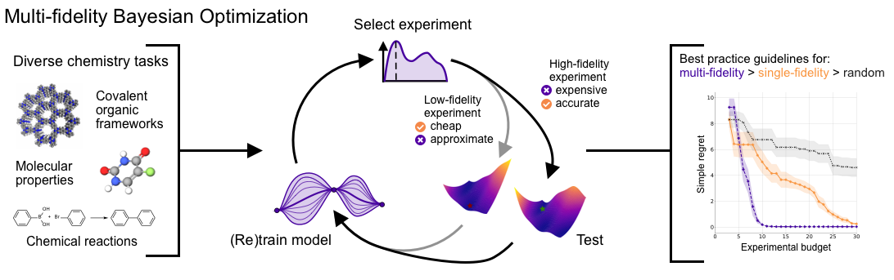

# Multi-fidelity BO for molecules and materials

In this repository, we run an investigation of Multi-fidelity Bayesian Optimization (MFBO) methods and their application to chemistry and materials problems.

We first conduct some benchmarks with 2 different acquisition functions and 2 synthetic functions. We also study the parameters favoring the MF approach over the standard single fidelity (SFBO).

We run 3 benchmarks in the chemical domain (optimization of Covalent Organic Frameworks (COFs), polarizable molecules and molecule solvation energy). Our study shows how MFBO can effectively reduce the overall cost of optimization tasks.



### 💻 Installation

Create a new environment

```
python -m venv venv
```
Activate the environment and install the package (make sure that you install `summit` first)
```
source venv/bin/activate

pip install summit

pip install .
```

If you want to use the hydra SLURM plugin to launch jobs on a cluster
```
pip install hydra-submitit-launcher --upgrade
```


### 🏋🏼 Benchmarks

If you want to launch the synthetic functions benchmark, use this command

```
python src/mf_kmc/benchmark/benchmark.py
```
Additionally, the sweep over synthetic functions can be run via

```
python src/mf_kmc/benchmark/benchmark.py --config-name=synthetic_sweep.yaml
```

The benchmarks for chemistry and materials design can be reproduced launching the following commands

```
python src/mf_kmc/benchmark/cofs.py
python src/mf_kmc/benchmark/polarizability.py
python src/mf_kmc/benchmark/freesolv.py
```

The negative cases can be launched with this commands

```
python src/mf_kmc/benchmark/polarizability.py --config-name=polarizability_bad
```

### 📈 Plotting
To plot the benchmarks results, include the corresponding results path in the `path` option of the corresponding plotting config file included in `config_plots/` and run the associated plotting script. As an example, the synthetic functions benchmark can be run with:

```
python src/mf_kmc/benchmark/plot_synthetic.py
```

### 🌟 Acknowledgements
This work was created in a collaboration between [Atinary Technologies Inc.](https://atinary.com/) and [LIAC](https://github.com/schwallergroup) - [LPDC](https://github.com/luterbachergroup), as part of the [EPFLglobaLeaders](https://www.epfl.ch/education/phd/doctoral-studies-structure/customized-curricula/epflglobaleaders/) program. The project was funded by [NCCR Catalysis](https://www.nccr-catalysis.ch/) (grant number 180544), a National Centre of Competence in Research funded by the Swiss National Science Foundation, and by the the European Union’s Horizon 2020 research and innovation program under the Marie Skłodowska-Curie grant agreement N° 945363.
